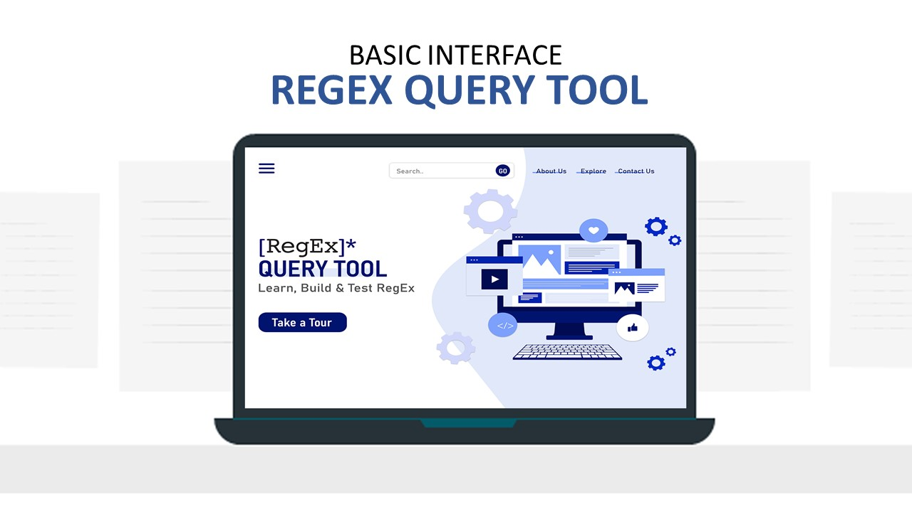
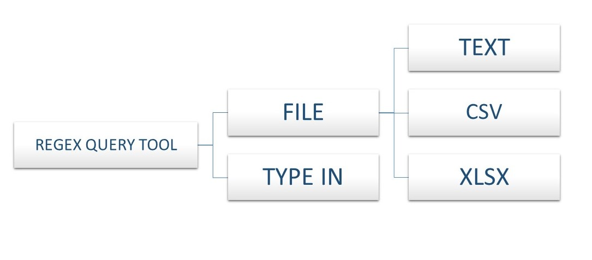

# Regex Query Tool

*The Regex Query Tool is use to verify that the regular expression and substitution patterns you 
enter will produce the desired results. You can search, find and replace words from your file just 
in few seconds with the help of this tool. Apart from that this tool will help you in finding 
IP addresses, correct URL as well as mail address etc.*

TECHSTACK
------

    
    
    
    
    
    

APPROACH
------
*The Regex Testers which are already available are quite challenging for non-technical persons. So we decided 
to solve this problem and make regex query tool easier for a common person. Anyone can find and replace any 
word in few seconds now. The main advantage of this tool which is quite unique is the support of files. Our 
tool support files like CSV, TXT, XLSX. Also we add a feature for users so they can interact with us. We tried to 
make it as much user friendly as possible to recover those problems. Hope this will help a user and user can 
save immense time by using this tool.*

DEVELOPERS
------
<!--

    <a href="https://www.linkedin.com/in/randrita-sarkar-8690591a1/" target="_blank"><u>Randrita Sarkar</u></a>  
    <a href="https://www.linkedin.com/in/soham-nandi-b39288215/" target="_blank"><u>Soham Nandi</u></a>

-->

 
 

 

Project Demo https://bit.ly/3yUgFdw :octocat:

~~THANK YOU~~ :tada:
--------------------------------

    <meta charset="UTF-8">
    <i> “Make it work, make it right, make it fast.” &#128151 </i>

